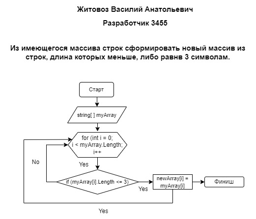

# Итоговая проверочная работа

## Задание

Написать программу, которая из имеющегося массива строк формирует новый массив из строк, длина которых __меньше, либо равна 3 символам__. Первоначальный массив можно ввести с клавиатуры, либо задать на старте выполнения алгоритма. *При решении не рекомендуется пользоваться коллекциями, лучше обойтись исключительно массивами.*

## Условия

1. Создать репозиторий на GitHub
2. Нарисовать блок-схему алгоритма *(можно обойтись блок-схемой основной содержательной части, если вы выделяете её в отдельный метод)*.
3. Снабдить репозиторий оформленным текстовым описанием решения __(файл README.md)__.
4. Написать программу, решающую поставленную задачу.
5. Использовать __контроль версий__ в работе над этим небольшим проектом *(не должно быть так, что всё залито одним коммитом, как минимум этапы 2, 3, и 4 должны быть расположены в разных коммитах)*.

## Примеры

[“Hello”, “2”, “world”, “:-)”] → [“2”, “:-)”]

[“1234”, “1567”, “-2”, “computer science”] → [“-2”]

[“Russia”, “Denmark”, “Kazan”] → []

## Описание решения

Инициализируем заданный массив на старте выполнения алгоритма, далее используем метод по выводу на монитор заданного массива. Применяем второй метод для формирования массива из строк, длина которыз меньше или равна 3 и выводим на монитор полученый массив.

